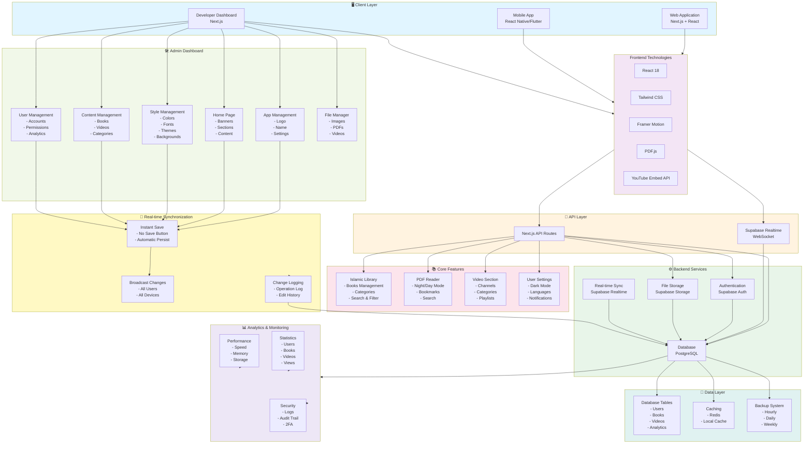
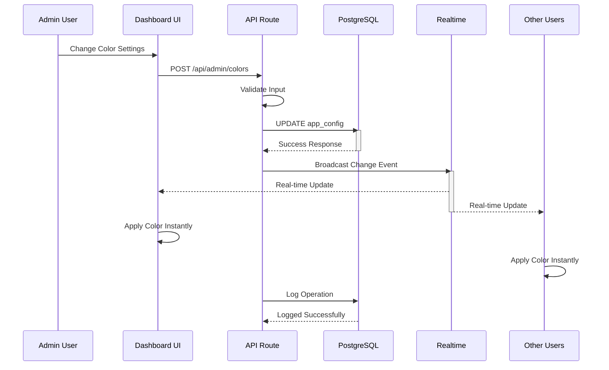
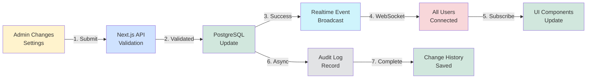
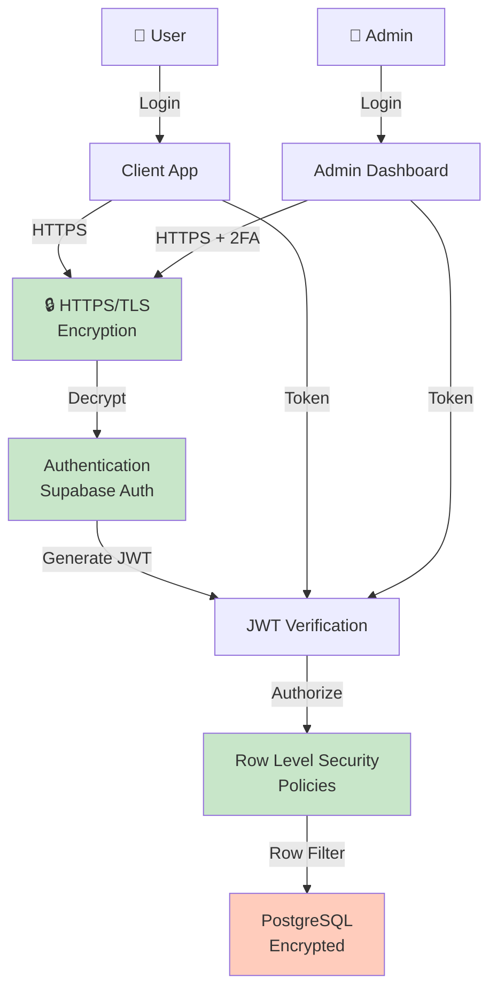

# دار العلوم - Architecture Overview

## Platform Architecture

دار العلوم is a comprehensive Islamic digital platform integrating books, video content, and advanced developer controls with real-time synchronization and instant persistence.



---

## System Layers

### 🖥️ Client Layer
The client layer consists of three main applications:
- **Web Application**: Next.js + React for desktop and tablet users
- **Mobile App**: React Native or Flutter for iOS and Android
- **Developer Dashboard**: Admin panel built with Next.js for system management

### 🎨 Frontend Technologies
- **React 18**: Modern UI framework with hooks and concurrent rendering
- **Tailwind CSS**: Utility-first CSS for responsive design with Glassmorphism
- **Framer Motion**: Animation library for smooth interactions
- **PDF.js**: Professional PDF rendering and reading
- **YouTube Embed API**: Video integration and playback

### 🔌 API Layer
- **Next.js API Routes**: RESTful API endpoints for data operations
- **Supabase Realtime WebSocket**: Real-time event broadcasting and synchronization

### ⚙️ Backend Services
- **Authentication**: Supabase Auth with JWT tokens and 2FA
- **Storage**: Supabase Storage for PDFs, images, and videos
- **Real-time Sync**: WebSocket-based instant synchronization
- **Database**: PostgreSQL with row-level security (RLS)

### 📚 Core Features
- **Islamic Library**: Book management, search, filtering, and reading history
- **PDF Reader**: Professional reader with night/day mode, bookmarks, and search
- **Video Section**: Channel organization, categorization, and streaming
- **User Settings**: Preferences for dark mode, language, and notifications

### 🛠️ Admin Dashboard
Comprehensive management system with:
- **App Management**: Logo, name, description, version, feature toggles
- **Home Page**: Banners, sections, featured content, daily quotes
- **Style Management**: Colors, fonts, themes, backgrounds with live preview
- **Content Management**: Books, videos, categories, channels
- **User Management**: Accounts, permissions, analytics, suspension
- **File Manager**: Organize and manage all media files

### 📊 Analytics & Monitoring
- **Statistics**: User counts, content metrics, engagement data
- **Performance**: Speed, memory, and storage monitoring
- **Security**: Audit logs, operation history, 2FA management

### 💾 Data Layer
- **Database Tables**: Users, books, videos, analytics, configuration
- **Caching**: Redis and local browser caching for performance
- **Backup System**: Hourly, daily, and weekly automated backups

### 🔄 Real-time Synchronization
- **Instant Save**: Changes persist immediately without save button
- **Broadcast Changes**: Updates propagate to all users in real-time
- **Change Logging**: Comprehensive audit trail of all modifications

---

## Data Flow Diagram



---

## Technology Stack

### Frontend Stack
| Technology | Purpose | Version |
|-----------|---------|---------|
| Next.js | Framework | 14+ |
| React | UI Library | 18 |
| Tailwind CSS | Styling | Latest |
| Framer Motion | Animations | Latest |
| PDF.js | PDF Rendering | Latest |
| TypeScript | Type Safety | Latest |

### Backend Stack
| Service | Purpose |
|---------|---------|
| Supabase Auth | User Authentication & JWT |
| PostgreSQL | Primary Database |
| Supabase Storage | File & Media Storage |
| Supabase Realtime | WebSocket Events |
| Row-Level Security | Data Protection |

### DevOps & Deployment
| Tool | Purpose |
|------|---------|
| Vercel | Frontend Hosting & CDN |
| GitHub | Version Control |
| GitHub Actions | CI/CD Pipeline |
| Sentry | Error Tracking |
| PostHog | Analytics |

---

## Key Features

### ✨ User Features
- 📚 Advanced Islamic book library with professional PDF reading
- 🎬 Video streaming with multiple channels and categories
- 🌙 Dark/Light mode toggle
- 🌍 Multi-language support (Arabic, English, Urdu, Hindi)
- ❤️ Favorites and reading history
- 🔔 Smart notifications
- 📖 Reading progress tracking
- 🏷️ Bookmarks and annotations

### ⚙️ Developer Features (Admin Panel)
- 🎨 **Complete UI customization without code**
  - Color management (primary, secondary, backgrounds, buttons)
  - Font management (TTF, OTF, WOFF support)
  - Theme system (5 pre-built themes + custom)
  - Background control (images, videos, GIF, animations)
  - Card styling (shape, size, shadows, borders, effects)

- 📊 **Real-time analytics dashboard**
  - User statistics
  - Content metrics
  - Engagement tracking
  - Performance monitoring

- 🔐 **Secure admin panel**
  - Password protection
  - Two-factor authentication
  - Complete audit logging
  - Login history tracking

- 📝 **Full content management system**
  - Book management (add, edit, delete, organize)
  - Video management (channels, categories, playlists)
  - Banner management (create, schedule, A/B test)
  - Page management (create custom pages)

- 👥 **User management**
  - Account management
  - Permission control
  - User statistics
  - Suspension and reactivation

- 📁 **Integrated file manager**
  - Image management
  - PDF organization
  - Video files
  - Logo storage
  - Search and categorization

- 🔄 **Real-time synchronization**
  - Instant changes across all users
  - No page refresh needed
  - Sub-100ms latency
  - Automatic persistence

- 💾 **Automatic backup and recovery**
  - Hourly backups
  - Daily backups
  - Weekly backups
  - Point-in-time recovery
  - Full data export

- 📋 **Complete audit logging**
  - Operation history
  - Edit tracking
  - User attribution
  - Timestamp recording

### 🚀 Technical Highlights
- ⚡ Zero-latency instant save functionality
- 🔄 Real-time changes broadcast (<100ms latency)
- 📱 Fully responsive (Web, Tablet, Mobile)
- 🎯 Modern 2026-level design with Glassmorphism
- 🔐 Two-factor authentication
- 📊 Comprehensive analytics
- 🛡️ Row-level security
- 💾 Point-in-time recovery

---

## Database Schema Overview

### Core Tables

#### Users Table
```sql
users
├── id (UUID, Primary Key)
├── email (Unique)
├── password_hash
├── full_name
├── profile_picture_url
├── language_preference
├── dark_mode (Boolean)
├── created_at (Timestamp)
└── updated_at (Timestamp)
```

#### Books Table
```sql
books
├── id (UUID, Primary Key)
├── title
├── author
├── description
├── category_id (FK)
├── pdf_url
├── cover_url
├── page_count
├── is_featured (Boolean)
├── created_at (Timestamp)
└── updated_at (Timestamp)
```

#### Videos Table
```sql
videos
├── id (UUID, Primary Key)
├── title
├── channel_id (FK)
├── category_id (FK)
├── youtube_id
├── thumbnail_url
├── description
├── view_count
├── created_at (Timestamp)
└── updated_at (Timestamp)
```

#### Reading History Table
```sql
reading_history
├── id (UUID, Primary Key)
├── user_id (FK)
├── book_id (FK)
├── last_page_read
├── progress_percentage
├── last_read_at (Timestamp)
└── updated_at (Timestamp)
```

#### App Configuration Table
```sql
app_config
├── id (UUID, Primary Key)
├── app_name
├── app_logo_url
├── app_icon_url
├── primary_color
├── secondary_color
├── background_color
├── text_color
├── heading_font
├── body_font
├── current_theme
└── updated_at (Timestamp)
```

#### Admin Activity Log Table
```sql
admin_activity_logs
├── id (UUID, Primary Key)
├── admin_id (FK)
├── action (VARCHAR)
├── table_name (VARCHAR)
├── changes_json (JSONB)
├── ip_address
├── timestamp (Timestamp)
└── status (success/failed)
```

---

## Real-time Synchronization Flow



---

## Security Architecture



---

## Deployment Architecture

```
┌───────────────────────────────────────────────────┐
│         Vercel (Frontend Hosting & CDN)           │
│  ┌─────────────────────────────────────────────┐  │
│  │ Web App │ Admin Panel │ API Routes (Edge)  │  │
│  └─────────────────────────────────────────────┘  │
│         Global CDN Distribution                   │
└────────────────────┬────────────────────────────┘
                     │ HTTPS
┌────────────────────▼────────────────────────────┐
│     Supabase (Backend Services)                 │
│  ┌──────────────┬──────────────┬──────────────┐ │
│  │ Auth Service │ PostgreSQL   │ Realtime WS  │ │
│  └──────────────┼──────────────┼──────────────┘ │
│  ┌──────────────────────────────────────────────┐│
│  │         Supabase Storage (S3)                ││
│  │  PDFs │ Images │ Videos │ Backups           ││
│  └──────────────────────────────────────────────┘│
└───────────────────────────────────────────────────┘
                     │
┌────────────────────▼───────────────────────────┐
│      External Integrations                     │
│  • YouTube API (Video Embed)                  │
│  • Email Service (SendGrid/Resend)            │
│  • Analytics (Sentry, PostHog)                │
└────────────────────────────────────────────────┘
```

---

## Performance Targets

| Metric | Target |
|--------|--------|
| Page Load Time | < 2 seconds |
| Time to Interactive | < 3 seconds |
| First Contentful Paint | < 1.5 seconds |
| Real-time Sync Latency | < 100ms |
| Database Query | < 200ms |
| API Response Time | < 300ms |
| Image Optimization | WebP + AVIF |
| Mobile Performance | LightHouse 90+ |

---

## Scalability Strategy

### Horizontal Scaling
- Load balancing via Vercel's global CDN
- Database read replicas for high-traffic queries
- Connection pooling for database efficiency
- WebSocket connection pooling for realtime

### Vertical Scaling
- Database instance upgrade (Supabase)
- Increased storage quotas
- Enhanced CDN capacity
- Caching layer optimization (Redis)

### Caching Strategy
- Browser cache for static assets
- CDN caching for images and PDFs
- Redis caching for frequently accessed data
- Database query result caching
- Local state caching in the application

---

## Monitoring & Observability

### Error Tracking (Sentry)
- JavaScript errors
- API errors
- Database errors
- Performance issues

### Analytics (PostHog/Mixpanel)
- User behavior tracking
- Feature usage analytics
- Conversion tracking
- Funnel analysis

### Performance Monitoring
- Core Web Vitals
- API response times
- Database query performance
- Realtime latency
- Storage usage

### Security Monitoring
- Failed login attempts
- Suspicious activity detection
- Data access patterns
- Admin action logging

---

## Backup & Disaster Recovery

### Automated Backups
- **Hourly**: Last 24 hours
- **Daily**: Last 7 days
- **Weekly**: Last 4 weeks
- **Monthly**: Long-term retention

### Recovery Procedures
- Point-in-time recovery
- Full database restore
- Selective table recovery
- Application code rollback

### RTO & RPO
- **RTO (Recovery Time Objective)**: < 15 minutes
- **RPO (Recovery Point Objective)**: < 1 hour

---

## Testing Strategy

### Unit Testing
- Component testing with React Testing Library
- Utility function testing with Jest
- API route testing

### Integration Testing
- Database integration tests
- API integration tests
- Real-time WebSocket tests

### E2E Testing
- User workflow testing with Cypress/Playwright
- Admin panel workflows
- Critical user journeys

### Performance Testing
- Load testing with Artillery
- Stress testing for scalability
- Real-time connection stress testing

---

## Future Enhancements

- [ ] AI-powered book recommendations
- [ ] Advanced search with NLP
- [ ] Community features (comments, ratings)
- [ ] Podcast integration
- [ ] Offline reading mode (PWA)
- [ ] Social sharing features
- [ ] User-generated content
- [ ] Advanced ML-based analytics
- [ ] Native mobile apps (iOS/Android)
- [ ] Multi-tenant support

---

## Documentation & Support

- **API Documentation**: See `/docs/API.md`
- **Database Schema**: See `/docs/DATABASE.md`
- **Deployment Guide**: See `/docs/DEPLOYMENT.md`
- **Security Guidelines**: See `/docs/SECURITY.md`
- **Contributing Guide**: See `CONTRIBUTING.md`

---

**Version**: 1.0.0  
**Last Updated**: June 2026  
**Maintained by**: Development Team  
**Status**: Production Ready ✅
